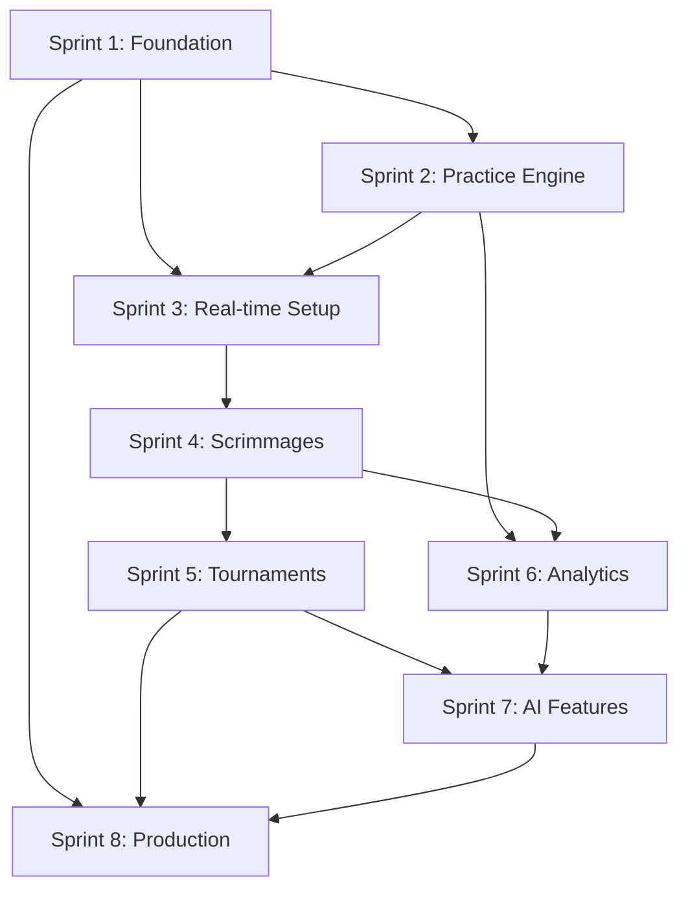

# Complete Sprint Planning (8 Sprints)

**Version**: 1.0.0  
**Created**: 2025-10-04  
**Duration**: 16 weeks (8 two-week sprints)  
**Team Size**: 4 developers  
**Sprint Capacity**: 38 story points per sprint (with 20% buffer)

---

## Sprint Overview

| Sprint | Weeks | Story Points | Epic Focus | Primary Goal |
|--------|-------|-------------|------------|--------------|
| Sprint 1 | 1-2 | 32 SP | Foundation | Development environment + Authentication |
| Sprint 2 | 3-4 | 36 SP | Practice Engine | Question management + Practice sessions |
| Sprint 3 | 5-6 | 20 SP | Practice + Real-time | Complete practice + Real-time infrastructure |
| Sprint 4 | 7-8 | 36 SP | Real-time Competition | Scrimmage system + Buzz adjudication |
| Sprint 5 | 9-10 | 24 SP | Tournaments | Tournament management + Production setup |
| Sprint 6 | 11-12 | 32 SP | Analytics | Team dashboard + Performance metrics |
| Sprint 7 | 13-14 | 20 SP | AI + Advanced | AI question generation + Advanced features |
| Sprint 8 | 15-16 | 24 SP | Production | Security + Monitoring + Launch readiness |

**Total Planned**: 224 SP  
**Total Capacity**: 304 SP  
**Utilization**: 74% (26% buffer for scope creep, bugs, learning)

---

## Sprint 1: Foundation Setup (Weeks 1-2)

### Sprint Goal
Establish a functional development environment where new users can register, authenticate, and access role-appropriate navigation.

### Sprint Backlog (32 Story Points)

#### Infrastructure & DevOps (8 SP)
- [ ] **INFRA-001** (3 SP): Set up Turborepo monorepo structure
- [ ] **INFRA-002** (2 SP): Configure Docker Compose for local development
- [ ] **INFRA-003** (3 SP): Implement GitHub Actions CI/CD pipeline

#### Database & Schema (8 SP)
- [ ] **DB-001** (5 SP): Implement Prisma schema with core models
- [ ] **DB-002** (2 SP): Create database seed script with sample data
- [ ] **DB-003** (1 SP): Set up database migrations and versioning

#### Authentication Service (8 SP)
- [ ] **AUTH-001** (3 SP): Implement user registration API with validation
- [ ] **AUTH-002** (3 SP): Implement JWT-based login/logout system
- [ ] **AUTH-003** (2 SP): Add role-based authorization middleware

#### Basic Frontend Foundation (8 SP)
- [ ] **FE-001** (3 SP): Set up Next.js 14 with Tailwind CSS and shadcn/ui
- [ ] **FE-002** (3 SP): Implement authentication flows (register, login pages)
- [ ] **FE-003** (2 SP): Create responsive navigation with role-based menus

### Sprint 1 Definition of Done
- [ ] Local development environment starts in < 10 minutes
- [ ] New user can register, login, and see appropriate navigation
- [ ] API endpoints return structured errors with proper HTTP status codes
- [ ] Basic permissions enforced at API level
- [ ] All code has >80% test coverage
- [ ] CI/CD pipeline runs successfully

---

## Sprint 2: Practice Engine Core (Weeks 3-4)

### Sprint Goal
Build a complete practice system where users can take customized question sessions and view results.

### Sprint Backlog (36 Story Points)

#### Question Management (12 SP)
- [ ] **QM-001** (5 SP): Implement Question CRUD API with category/difficulty filtering
- [ ] **QM-002** (3 SP): Add question search and pagination functionality
- [ ] **QM-003** (4 SP): Create question import system (CSV format with validation)

#### Practice Session Engine (12 SP)
- [ ] **PRACTICE-001** (5 SP): Implement practice session creation with configurable filters
- [ ] **PRACTICE-002** (4 SP): Build question serving API with randomization logic
- [ ] **PRACTICE-003** (3 SP): Add response tracking and basic scoring calculation

#### Practice Frontend (12 SP)
- [ ] **FE-PRACTICE-001** (5 SP): Create practice session configuration UI
- [ ] **FE-PRACTICE-002** (4 SP): Implement question display interface with timer
- [ ] **FE-PRACTICE-003** (3 SP): Build practice results view with statistics

### Sprint 2 Definition of Done
- [ ] User can complete a 20-question practice session
- [ ] Questions are served without repetition within session
- [ ] Basic accuracy statistics calculated and displayed
- [ ] Moderators can import questions via CSV
- [ ] Practice sessions persist and can be resumed
- [ ] All new APIs documented with OpenAPI specs

---

## Sprint 3: Practice Polish + Real-time Setup (Weeks 5-6)

### Sprint Goal
Complete the practice system with advanced features and establish real-time infrastructure for competitions.

### Sprint Backlog (20 Story Points)

#### Practice System Completion (12 SP)
- [ ] **PRACTICE-004** (4 SP): Add practice session history and analytics
- [ ] **PRACTICE-005** (3 SP): Implement team practice sessions
- [ ] **PRACTICE-006** (2 SP): Add practice session sharing and templates
- [ ] **QM-004** (3 SP): Add question moderation and approval workflow

#### Real-time Infrastructure (8 SP)
- [ ] **RT-001** (3 SP): Set up Socket.IO with namespace architecture
- [ ] **RT-002** (3 SP): Implement connection management and user presence
- [ ] **RT-003** (2 SP): Add Redis integration for real-time state persistence

### Sprint 3 Definition of Done
- [ ] Teams can take practice sessions together
- [ ] Practice analytics show detailed performance trends
- [ ] Real-time infrastructure supports 50+ concurrent connections
- [ ] Connection drops and reconnections handled gracefully
- [ ] Question moderation workflow functional
- [ ] Performance baseline established (< 200ms API response times)

---

## Sprint 4: Scrimmage Engine (Weeks 7-8)

### Sprint Goal
Implement real-time scrimmages with buzz adjudication and live scoring.

### Sprint Backlog (36 Story Points)

#### Scrimmage Core Engine (16 SP)
- [ ] **SCRIMMAGE-001** (5 SP): Implement scrimmage room creation and team invitations
- [ ] **SCRIMMAGE-002** (5 SP): Build buzz adjudication engine with collision handling
- [ ] **SCRIMMAGE-003** (3 SP): Add scoring system with configurable rules
- [ ] **SCRIMMAGE-004** (3 SP): Implement transcript generation and state recovery

#### Real-time Frontend (12 SP)
- [ ] **FE-RT-001** (4 SP): Build scrimmage interface with real-time buzzer
- [ ] **FE-RT-002** (4 SP): Implement host controls (pause/resume, skip, override)
- [ ] **FE-RT-003** (2 SP): Add spectator mode for scrimmages
- [ ] **FE-RT-004** (2 SP): Create real-time scoring display

#### Advanced Real-time Features (8 SP)
- [ ] **RT-004** (3 SP): Implement buzz timing and latency optimization
- [ ] **RT-005** (3 SP): Add voice chat integration (basic)
- [ ] **RT-006** (2 SP): Create session recording and playback

### Sprint 4 Definition of Done
- [ ] Two teams can complete a scrimmage with real-time buzzing
- [ ] P95 buzz latency < 200ms in development environment
- [ ] Buzz collisions resolved deterministically
- [ ] Reconnection works without losing match state
- [ ] Host can control game flow effectively
- [ ] Spectators can watch without affecting gameplay

---

## Sprint 5: Tournament System (Weeks 9-10)

### Sprint Goal
Build tournament management system with bracket generation and production deployment pipeline.

### Sprint Backlog (24 Story Points)

#### Tournament Management (12 SP)
- [ ] **TOURNAMENT-001** (4 SP): Create tournament CRUD with registration system
- [ ] **TOURNAMENT-002** (5 SP): Implement bracket generation algorithms
- [ ] **TOURNAMENT-003** (3 SP): Add match result entry and standings calculation

#### Production Infrastructure (8 SP)
- [ ] **PROD-001** (3 SP): Set up production deployment pipeline
- [ ] **PROD-002** (2 SP): Configure production database and Redis
- [ ] **PROD-003** (3 SP): Implement health checks and monitoring basics

#### Tournament Frontend (4 SP)
- [ ] **FE-TOURNAMENT-001** (2 SP): Create tournament bracket visualization
- [ ] **FE-TOURNAMENT-002** (2 SP): Implement tournament management interface

### Sprint 5 Definition of Done
- [ ] Tournament brackets generate correctly for 8+ teams
- [ ] Multiple tournament formats supported (round-robin, elimination)
- [ ] Production environment deployed and accessible
- [ ] Basic monitoring and alerting in place
- [ ] Tournament results properly calculated and displayed
- [ ] Match scheduling and notifications working

---

## Sprint 6: Analytics Foundation (Weeks 11-12)

### Sprint Goal
Implement comprehensive team analytics and performance dashboard with data visualization.

### Sprint Backlog (32 Story Points)

#### Analytics Backend (16 SP)
- [ ] **ANALYTICS-001** (4 SP): Implement aggregate statistics calculation service
- [ ] **ANALYTICS-002** (5 SP): Build team dashboard API with performance metrics
- [ ] **ANALYTICS-003** (3 SP): Add performance trend analysis
- [ ] **ANALYTICS-004** (4 SP): Implement caching strategy for analytics data

#### Analytics Frontend (12 SP)
- [ ] **FE-ANALYTICS-001** (5 SP): Create analytics dashboard UI with charts
- [ ] **FE-ANALYTICS-002** (3 SP): Add data export functionality
- [ ] **FE-ANALYTICS-003** (4 SP): Implement performance comparison tools

#### Performance Optimization (4 SP)
- [ ] **PERF-001** (2 SP): Optimize database queries with proper indexing
- [ ] **PERF-002** (2 SP): Implement Redis caching for frequently accessed data

### Sprint 6 Definition of Done
- [ ] Team dashboard shows performance trends and category analysis
- [ ] Analytics data updates in real-time during competitions
- [ ] Export functionality works for CSV and PDF formats
- [ ] Page load times < 2 seconds for analytics dashboard
- [ ] Database query performance optimized
- [ ] Caching reduces database load by 70%

---

## Sprint 7: AI Enhancement + Advanced Features (Weeks 13-14)

### Sprint Goal
Integrate AI question generation and implement advanced competition features.

### Sprint Backlog (20 Story Points)

#### AI Question Generation (12 SP)
- [ ] **AI-001** (5 SP): Integrate OpenAI API for question generation
- [ ] **AI-002** (4 SP): Implement duplicate detection using embeddings
- [ ] **AI-003** (3 SP): Build approval workflow for AI-generated questions

#### Advanced Features (8 SP)
- [ ] **ADVANCED-001** (3 SP): Add power scoring mode with configurable thresholds
- [ ] **ADVANCED-002** (3 SP): Implement advanced tournament formats
- [ ] **ADVANCED-003** (2 SP): Add question difficulty auto-adjustment

### Sprint 7 Definition of Done
- [ ] AI can generate questions behind feature flag
- [ ] Duplicate detection prevents similar questions
- [ ] Approval workflow functional for moderators
- [ ] Power scoring mode works correctly in scrimmages
- [ ] Advanced tournament formats generate proper brackets
- [ ] Feature flags properly control AI functionality

---

## Sprint 8: Production Hardening (Weeks 15-16)

### Sprint Goal
Achieve production readiness with comprehensive security, monitoring, and operational procedures.

### Sprint Backlog (24 Story Points)

#### Security Hardening (8 SP)
- [ ] **SEC-001** (3 SP): Implement rate limiting across all endpoints
- [ ] **SEC-002** (3 SP): Add input sanitization and XSS protection
- [ ] **SEC-003** (2 SP): Security audit and penetration testing

#### Monitoring & Observability (8 SP)
- [ ] **MON-001** (3 SP): Implement comprehensive logging with correlation IDs
- [ ] **MON-002** (3 SP): Add performance monitoring with key metrics
- [ ] **MON-003** (2 SP): Create operational dashboards and alerting

#### Reliability & Operations (8 SP)
- [ ] **OPS-001** (3 SP): Set up backup and disaster recovery procedures
- [ ] **OPS-002** (3 SP): Implement graceful shutdown and health checks
- [ ] **OPS-003** (2 SP): Create operational runbooks and documentation

### Sprint 8 Definition of Done
- [ ] Security scanning shows no critical vulnerabilities
- [ ] Comprehensive monitoring covers all key metrics
- [ ] Backup and recovery procedures tested
- [ ] Load testing validates performance under expected traffic
- [ ] Operational runbooks complete and tested
- [ ] Production environment ready for public launch

---

## Sprint Dependencies and Critical Path

### Cross-Sprint Dependencies

### Critical Path Items
1. **Authentication System** (Sprint 1) - Blocks all user-specific features
2. **Real-time Infrastructure** (Sprint 3) - Blocks all competition features
3. **Scrimmage Engine** (Sprint 4) - Blocks tournament and analytics features
4. **Production Deployment** (Sprint 5) - Required for production hardening

### Risk Mitigation by Sprint
| Sprint | Primary Risk | Mitigation Strategy |
|--------|-------------|-------------------|
| Sprint 1 | Environment complexity | Early setup, detailed documentation |
| Sprint 2 | Question data model | Prototype early, stakeholder review |
| Sprint 3 | Real-time latency | Performance testing, architecture review |
| Sprint 4 | Buzz collision edge cases | Extensive testing, clear specifications |
| Sprint 5 | Tournament algorithm complexity | Research existing solutions, simplify MVP |
| Sprint 6 | Analytics performance | Incremental optimization, caching strategy |
| Sprint 7 | AI integration costs | Quota management, fallback strategies |
| Sprint 8 | Production reliability | Staged rollout, comprehensive testing |

---

## Sprint Retrospective Template

### Sprint Retrospective Questions
1. **What went well this sprint?**
2. **What could be improved?**
3. **What will we commit to improve next sprint?**
4. **Any blockers or impediments to address?**

### Key Metrics to Track
- **Velocity**: Story points completed vs. planned
- **Quality**: Bugs found in testing vs. production
- **Predictability**: Estimation accuracy
- **Team Health**: Workload distribution and satisfaction

### Sprint Review Checklist
- [ ] All acceptance criteria met
- [ ] Demo prepared for stakeholders
- [ ] Documentation updated
- [ ] Performance benchmarks met
- [ ] Security review completed (if applicable)
- [ ] Ready for production deployment (final sprints)

---

This comprehensive 8-sprint plan provides detailed breakdown of all 16 weeks with clear goals, dependencies, and success criteria for each sprint. The plan maintains flexibility while ensuring steady progress toward the production-ready Quiz Bowl platform.