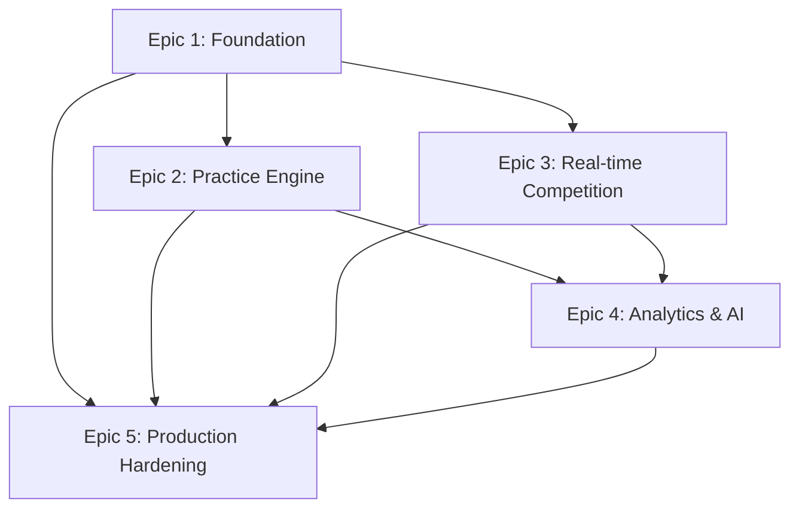

# Epic & Task Breakdown

**Version**: 1.0.0  
**Created**: 2025-10-04  
**Derived From**: Technical Implementation Plan v1.0.0

---

## Epic Structure Overview

```
├── Epic 1: Platform Foundation (Weeks 1-4)
├── Epic 2: Practice Engine (Weeks 5-8)  
├── Epic 3: Real-time Competition (Weeks 9-12)
├── Epic 4: Analytics & AI (Weeks 13-16)
└── Epic 5: Production Hardening (Ongoing)
```

---

## Epic 1: Platform Foundation (32 Story Points)

### 1.1 Infrastructure & DevOps (8 SP)
**Stories:**
- [x] **INFRA-001** (3 SP): Set up Turborepo monorepo with apps/web, apps/api, packages/types structure ✅ **COMPLETED**
- [x] **INFRA-002** (2 SP): Configure Docker Compose for local development (PostgreSQL + Redis + API + Web) ✅ **COMPLETED**
- [ ] **INFRA-003** (3 SP): Implement GitHub Actions CI/CD pipeline (lint, test, build, deploy to staging)

### 1.2 Database & Schema (8 SP)
**Stories:**
- [x] **DB-001** (5 SP): Implement Prisma schema with User, Team, TeamMember, Question core models ✅ **COMPLETED**
- [ ] **DB-002** (2 SP): Create database seed script with sample users, teams, and 50 practice questions
- [ ] **DB-003** (1 SP): Set up database migrations and versioning strategy

### 1.3 Authentication Service (8 SP)
**Stories:**
- [ ] **AUTH-001** (3 SP): Implement user registration API with input validation (Zod schemas)
- [ ] **AUTH-002** (3 SP): Implement JWT-based login/logout with refresh token strategy
- [ ] **AUTH-003** (2 SP): Add role-based authorization middleware (PLAYER, COACH, MODERATOR, ADMIN)

### 1.4 Basic Frontend Foundation (8 SP)
**Stories:**
- [ ] **FE-001** (3 SP): Set up Next.js 14 with Tailwind CSS and shadcn/ui component library
- [ ] **FE-002** (3 SP): Implement authentication flows (register, login, logout pages)
- [ ] **FE-003** (2 SP): Create responsive navigation with role-based menu items

**Epic 1 Definition of Done:**
- Local development environment starts in < 10 minutes
- New user can register, login, and see appropriate navigation
- API endpoints return structured errors with proper HTTP status codes
- Basic permissions enforced at API level

---

## Epic 2: Practice Engine (36 Story Points)

### 2.1 Question Management (12 SP)
**Stories:**
- [ ] **QM-001** (5 SP): Implement Question CRUD API with category/difficulty filtering
- [ ] **QM-002** (3 SP): Add question search and pagination (by text, category, source)
- [ ] **QM-003** (4 SP): Create question import system (CSV format with validation)

### 2.2 Practice Session Engine (12 SP)
**Stories:**
- [ ] **PRACTICE-001** (5 SP): Implement practice session creation with configurable filters (category, difficulty, count)
- [ ] **PRACTICE-002** (4 SP): Build question serving API with randomization and no-repeat logic
- [ ] **PRACTICE-003** (3 SP): Add response tracking and basic scoring calculation

### 2.3 Practice Frontend (12 SP)
**Stories:**
- [ ] **FE-PRACTICE-001** (5 SP): Create practice session configuration UI with filter options
- [ ] **FE-PRACTICE-002** (4 SP): Implement question display interface with timer and answer submission
- [ ] **FE-PRACTICE-003** (3 SP): Build practice results view with accuracy and timing statistics

**Epic 2 Definition of Done:**
- User can complete a 20-question practice session
- Questions are served without repetition within session
- Basic accuracy statistics calculated and displayed
- Moderators can import questions via CSV

---

## Epic 3: Real-time Competition (44 Story Points)

### 3.1 Real-time Infrastructure (8 SP)
**Stories:**
- [ ] **RT-001** (3 SP): Set up Socket.IO with namespace architecture (/scrimmage/:id, /presence)
- [ ] **RT-002** (3 SP): Implement connection management and room-based user presence
- [ ] **RT-003** (2 SP): Add Redis integration for real-time state persistence

### 3.2 Scrimmage Engine (16 SP)
**Stories:**
- [ ] **SCRIMMAGE-001** (5 SP): Implement scrimmage room creation and team invitation system
- [ ] **SCRIMMAGE-002** (5 SP): Build buzz adjudication engine with deterministic collision handling
- [ ] **SCRIMMAGE-003** (3 SP): Add scoring system with configurable rules (standard/power/neg modes)
- [ ] **SCRIMMAGE-004** (3 SP): Implement transcript generation and state recovery

### 3.3 Tournament Management (12 SP)
**Stories:**
- [ ] **TOURNAMENT-001** (4 SP): Create tournament CRUD with registration system
- [ ] **TOURNAMENT-002** (5 SP): Implement bracket generation algorithms (round-robin, single elimination)
- [ ] **TOURNAMENT-003** (3 SP): Add match result entry and standings calculation

### 3.4 Real-time Frontend (8 SP)
**Stories:**
- [ ] **FE-RT-001** (4 SP): Build scrimmage interface with real-time buzzer and scoring display
- [ ] **FE-RT-002** (2 SP): Implement host controls (pause/resume, skip, manual override)
- [ ] **FE-RT-003** (2 SP): Create tournament bracket visualization and management interface

**Epic 3 Definition of Done:**
- Two teams can complete a scrimmage with real-time buzzing
- P95 buzz latency < 200ms in development environment
- Tournament brackets generate correctly for 8+ teams
- Reconnection works without losing match state

---

## Epic 4: Analytics & AI Enhancement (32 Story Points)

### 4.1 Team Analytics (12 SP)
**Stories:**
- [ ] **ANALYTICS-001** (4 SP): Implement aggregate statistics calculation service with caching
- [ ] **ANALYTICS-002** (4 SP): Build team dashboard API with performance metrics and trends
- [ ] **ANALYTICS-003** (4 SP): Create analytics dashboard UI with charts and export functionality

### 4.2 AI Question Generation (12 SP)
**Stories:**
- [ ] **AI-001** (5 SP): Integrate OpenAI API for question generation with prompt engineering
- [ ] **AI-002** (4 SP): Implement duplicate detection using embedding similarity
- [ ] **AI-003** (3 SP): Build approval workflow for AI-generated questions

### 4.3 Advanced Features (8 SP)
**Stories:**
- [ ] **ADVANCED-001** (3 SP): Add power scoring mode with configurable thresholds
- [ ] **ADVANCED-002** (3 SP): Implement advanced tournament formats (hybrid round-robin + elimination)
- [ ] **ADVANCED-003** (2 SP): Add spectator mode for scrimmages

**Epic 4 Definition of Done:**
- Team dashboard shows performance trends and category analysis
- AI can generate questions behind feature flag with approval workflow
- Advanced scoring modes function correctly in scrimmages

---

## Epic 5: Production Hardening (Ongoing - 24 SP)

### 5.1 Performance & Monitoring (8 SP)
**Stories:**
- [ ] **PERF-001** (3 SP): Implement comprehensive logging with structured format and correlation IDs
- [ ] **PERF-002** (3 SP): Add performance monitoring with key metrics and alerting
- [ ] **PERF-003** (2 SP): Optimize database queries and implement caching strategy

### 5.2 Security Hardening (8 SP)
**Stories:**
- [ ] **SEC-001** (3 SP): Implement rate limiting across all endpoints with configurable thresholds
- [ ] **SEC-002** (3 SP): Add input sanitization and XSS protection
- [ ] **SEC-003** (2 SP): Security audit and penetration testing preparation

### 5.3 Reliability & Operations (8 SP)
**Stories:**
- [ ] **OPS-001** (3 SP): Set up health checks and graceful shutdown procedures
- [ ] **OPS-002** (3 SP): Implement backup and disaster recovery procedures
- [ ] **OPS-003** (2 SP): Create operational runbooks and monitoring dashboards

---

## Story Sizing Reference

**Story Point Scale:**
- **1 SP**: 1-2 hours (simple config, minor UI component)
- **2 SP**: Half day (basic CRUD endpoint, simple form)
- **3 SP**: 1 day (complex API endpoint, modal with validation)
- **5 SP**: 2-3 days (real-time feature, complex algorithm)
- **8 SP**: 1 week (major subsystem, complex integration)

**Estimation Factors:**
- Complexity of business logic
- Integration requirements
- Testing needs
- Documentation requirements
- Unknown/research components

---

## Dependencies & Critical Path

### External Dependencies
- OpenAI API access and billing setup (affects AI epic)
- Railway/Vercel deployment account setup (affects production deployment)
- Domain name and SSL certificate setup (affects production launch)

### Internal Dependencies


### Critical Path Risks
1. **Real-time latency requirements** (Week 9-10): May require architecture adjustments
2. **AI integration complexity** (Week 14-15): API limits or quality issues could delay delivery
3. **Tournament algorithm complexity** (Week 11): Non-standard team counts may require additional logic

---

## Sprint Planning Recommendations

### Sprint Length: 2 weeks

### Total Sprint Count: 8 Sprints (16 weeks)

### Sprint Allocation with Story Points:
- **Sprint 1** (Weeks 1-2): Epic 1 Foundation (32 SP)
- **Sprint 2** (Weeks 3-4): Epic 2 Practice Engine Part 1 (36 SP)
- **Sprint 3** (Weeks 5-6): Epic 2 Practice Engine Part 2 + Epic 3 Real-time Setup (20 SP)
- **Sprint 4** (Weeks 7-8): Epic 3 Real-time Competition Part 1 (36 SP)
- **Sprint 5** (Weeks 9-10): Epic 3 Real-time Competition Part 2 (24 SP + Production items)
- **Sprint 6** (Weeks 11-12): Epic 4 Analytics & AI Part 1 (32 SP)
- **Sprint 7** (Weeks 13-14): Epic 4 Analytics & AI Part 2 + Advanced Features (20 SP)
- **Sprint 8** (Weeks 15-16): Production Hardening & Launch Prep (24 SP)

### Capacity Planning:
- **Assumption**: 4-person team, 6 SP per person per sprint (48 SP total per 2-week sprint)
- **Buffer**: 20% capacity reserved for bug fixes and scope creep
- **Effective Capacity**: ~38 SP per sprint
- **Total Capacity**: 304 SP across 8 sprints
- **Planned Work**: 288 SP (95% utilization with built-in buffer)

### Detailed Sprint Goals:

#### **Sprint 1: Foundation Setup** (32 SP)
**Goal**: Functional development environment with authentication and basic team management
**Key Deliverables**:
- Complete development environment (Docker, Turborepo)
- User authentication system (register, login, JWT)
- Basic frontend with responsive navigation
- Database schema with core models

#### **Sprint 2: Practice Engine Core** (36 SP) 
**Goal**: Working practice mode with question management
**Key Deliverables**:
- Question CRUD API with search and filtering
- Practice session creation and configuration
- Question serving engine with randomization
- Basic practice UI for taking sessions

#### **Sprint 3: Practice Polish + Real-time Setup** (20 SP)
**Goal**: Complete practice system and establish real-time infrastructure
**Key Deliverables**:
- Practice results and analytics display
- Question import system for moderators
- Socket.IO infrastructure setup
- Real-time connection management

#### **Sprint 4: Scrimmage Engine** (36 SP)
**Goal**: Real-time scrimmages with buzz adjudication
**Key Deliverables**:
- Scrimmage room creation and invitations
- Real-time buzzer system with collision handling
- Live scoring and transcript generation
- Basic scrimmage UI with host controls

#### **Sprint 5: Tournament System** (24 SP + Production Setup)
**Goal**: Tournament management with bracket generation
**Key Deliverables**:
- Tournament CRUD and registration system
- Bracket generation algorithms
- Match result entry and standings
- Production deployment pipeline

#### **Sprint 6: Analytics Foundation** (32 SP)
**Goal**: Team dashboard and performance analytics
**Key Deliverables**:
- Aggregate statistics calculation service
- Team dashboard API with metrics
- Analytics UI with charts and trends
- Performance optimization and caching

#### **Sprint 7: AI Enhancement** (20 SP)
**Goal**: AI question generation and advanced features
**Key Deliverables**:
- OpenAI integration for question generation
- Duplicate detection with embeddings
- Approval workflow for AI content
- Advanced scoring modes

#### **Sprint 8: Production Hardening** (24 SP)
**Goal**: Production readiness and launch preparation
**Key Deliverables**:
- Comprehensive monitoring and logging
- Security hardening and rate limiting
- Performance optimization
- Backup and disaster recovery procedures

---

## Acceptance Criteria Templates

### API Story Template
```
Given I am a [role]
When I [action] 
Then I should [expected outcome]
And the response should [format/validation requirements]
And the system should [logging/monitoring requirements]
```

### Real-time Story Template  
```
Given [initial state]
When [event occurs]
Then all connected clients should [receive update]
And the latency should be [performance requirement]
And the state should [consistency requirement]
```

### UI Story Template
```
Given I am on [page/component]
When I [user action]
Then I should see [visual feedback]
And the interface should [accessibility requirement]
And errors should [error handling requirement]
```

---

## Quality Gates

### Story Completion Criteria
- [ ] Acceptance criteria met
- [ ] Unit tests written and passing (>80% coverage for new code)
- [ ] Integration tests added for API changes
- [ ] Code review completed and approved
- [ ] Documentation updated
- [ ] Manual testing completed
- [ ] Performance impact assessed

### Epic Completion Criteria
- [ ] All stories in epic completed
- [ ] End-to-end testing scenarios passed
- [ ] Performance benchmarks met
- [ ] Security review completed (if applicable)
- [ ] Deployment tested in staging environment
- [ ] Product owner acceptance confirmed

---

## Risk Mitigation

### Technical Risks by Epic
| Epic | Primary Risk | Mitigation Strategy |
|------|-------------|-------------------|
| Epic 1 | Docker/environment complexity | Detailed setup documentation, automated scripts |
| Epic 2 | Question data quality issues | Validation rules, moderation workflow |
| Epic 3 | Real-time latency requirements | Early prototyping, performance testing |
| Epic 4 | AI API costs/limits | Quota management, fallback content |
| Epic 5 | Production scaling issues | Load testing, monitoring implementation |

### Schedule Risks
- **Scope creep**: Weekly stakeholder reviews with clear change process
- **Technical debt**: 20% sprint capacity reserved for refactoring
- **Team velocity**: Track actual vs estimated story points, adjust planning

---

This epic and task breakdown provides a detailed roadmap for implementing the QuizBowlHub platform with clear deliverables, dependencies, and quality gates for each phase of development.